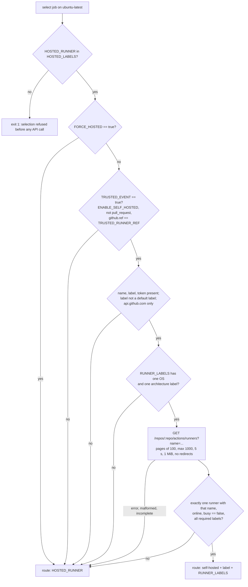
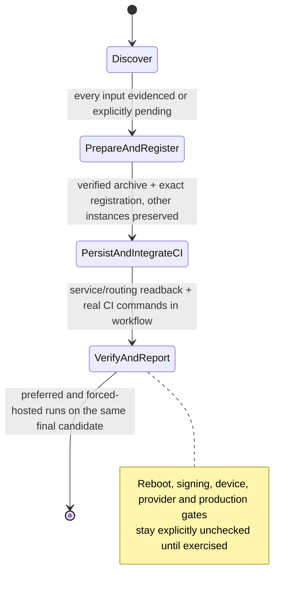
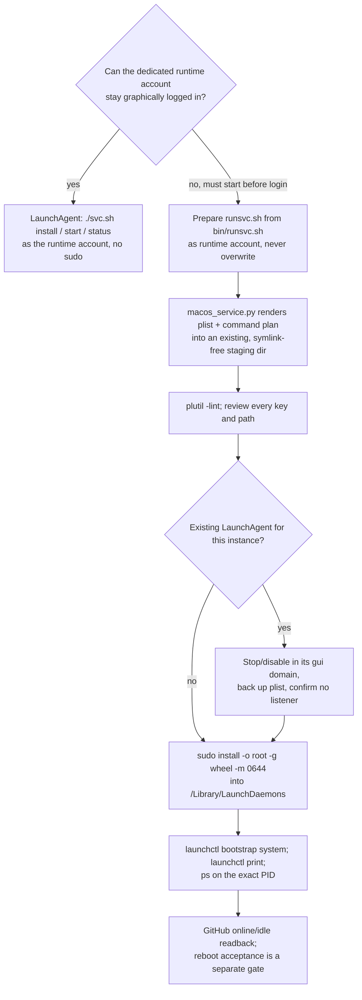
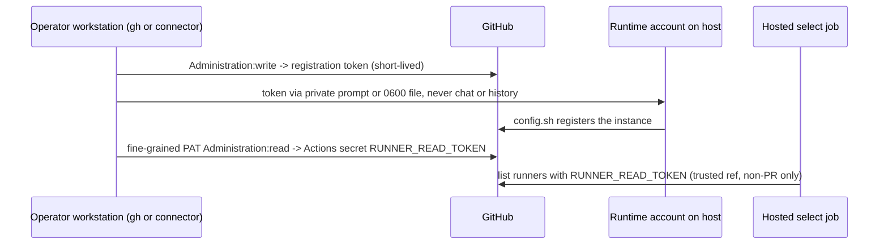

# Documentation audit — `github-runner` skill — 2026-10-08

| | |
| --- | --- |
| Audit | docs (drift, structure, coverage) |
| Auditor model | Claude Fable 5.1 (`claude-fable-5-1`) |
| Snapshot | HEAD `8d6598de262ea3bef0f947c30aa747d5c8ea7263` (short `8d6598d`), branch `feat/github-runner`, tree **DIRTY** by explicit human opt-in |
| Scoped README diff sha256 | `21779ad43faa6e44eb4aec8d789646116f95a28dbd633aaeb0f32c778cb23502` (re-verified) |
| Baseline manifest | all 20 in-scope files byte-identical to the orchestrator manifest (re-verified after every check); 8 pre-existing `.pyc` files unchanged |
| Target | `github-runner/**` (19 untracked files) + `git diff HEAD -- README.md`; treated as the whole product |
| Prior reports | none (docs/audits/ did not exist before this run; sibling reports in the run directory deliberately not read) |
| Writes | this report and its `.findings.json` sidecar only; no source, git or configuration changes |

Assumption recorded: no human was available; the human scope/safety overrides in `worker-common.md` were applied over the broader spec (bounded target, read-only source, tests only in `mktemp` dirs with `PYTHONDONTWRITEBYTECODE=1`, no network, no live hosts).

## 1. Summary

10 findings: 0 Critical, 1 High, 4 Medium, 5 Low. Evidence: 10 CONFIRMED, 0 PLAUSIBLE, 0 BLOCKED, 0 NOT REPRODUCED as findings (blocked checks and discarded candidates are listed in sections 3–4).

The documentation is unusually honest about what it does not prove, every relative link resolves, every documented local check passes, and the numeric limits stated in prose match the code exactly. The real problems are in the narrow places where an operator or agent has to act on a contract that the docs state incompletely or bury: one silent configuration rule of the CI selector (D1), no route for diagnosing why a job went to the hosted fallback (D2), a format check that cites a tool the reader cannot find or run (D3), the single most consequential prerequisite of the CI integration hidden mid-paragraph (D4), and helper CLI contracts (output shapes, exit codes, path preconditions) that exist only in `--help` and source (D5).

| ID | Severity | Document | One-line issue | Evidence |
| --- | --- | --- | --- | --- |
| D1 | High | `github-runner/references/ci.md:15` | `RUNNER_LABELS` row omits the rule that the array must contain one OS label **and** one architecture label; otherwise the selector silently returns the hosted fallback with no API call | CONFIRMED |
| D2 | Medium | `github-runner/references/ci.md:31`, `references/verification.md:35-39` | Selector fallback has ~10 causes listed in one 131-word sentence, the step emits no reason, and the troubleshooting section has no "job ran hosted although the preferred runner was online" boundary | CONFIRMED |
| D3 | Medium | `github-runner/README.md:47` | "Format: run the skill-creator `scripts/quick_validate.py`" names a tool that is not in the repo, not linked, and (where found on this machine) fails without an undeclared `pyyaml` dependency | CONFIRMED |
| D4 | Medium | `github-runner/references/ci.md:7` | The default-branch bootstrap prerequisite for `workflow_dispatch` (the defect the skill's own evaluation log says was found in practice) is sentence 7 of a 13-sentence, 188-word paragraph | CONFIRMED |
| D5 | Medium | `github-runner/references/setup.md:20-26` (+ `discovery.md:27`, `verification.md:21`, `README.md:38-41`) | Helper CLI contract undocumented: `inspect` JSON shape, `.preparation.json` fields/states, `runner=` output line, exit codes (1 vs 2), and the resolved-path/no-symlink precondition that is documented for `macos_service.py` but not for `prepare_runner.py` | CONFIRMED |
| D6 | Low | `github-runner/README.md:7-18,24` | Install/invoke conventions differ from the root README and sibling skills (`--skill` vs `@<skill>`, "after this skill is published", `$github-runner` vs `/…`) | CONFIRMED |
| D7 | Low | `github-runner/references/platforms.md:7` (canonical) and 7 other locations | Same facts restated in many places: dedicated-account rule (8×), Python 3.9+ (4×), test command (3 forms), hosted-label verification date (2×) | CONFIRMED |
| D8 | Low | `github-runner/tests/scenarios.md:40-58` | Reusable scenario spec and a dated evaluation log (tool versions, test counts, process history) share one document; the counts are correct today and will drift | CONFIRMED |
| D9 | Low | `github-runner/references/platforms.md:1-84` | 12.8 KB file bundles common rules + Linux + macOS + Windows + availability while `SKILL.md:26` tells the agent to load "the target branch" | CONFIRMED |
| D10 | Low | `github-runner/SKILL.md:8-36`, `references/ci.md:23-34` | No diagram anywhere; the four-gate lifecycle, selector routing decision, credential boundaries and macOS agent-to-daemon conversion are prose only | CONFIRMED |

## 2. Documentation map

### Current

| Document | Mode | Claims to cover | Audience | How a reader finds it |
| --- | --- | --- | --- | --- |
| `README.md` (root, diff only in scope) | index / reference | Skill table row + "Checks" paragraph | Human browsing the repo | Repo landing page |
| `github-runner/README.md` | how-to + reference (resource table) | Install, use, resources, limits, checks | Human installing or maintaining the skill | Root README link; skills CLI listing |
| `github-runner/SKILL.md` | agent-facing procedure (how-to) | Four gates: discover, prepare/register, persist+CI, verify | Agent (Claude/Codex) | Skill trigger by description |
| `github-runner/agents/openai.yaml` | generated/reference surface | Codex UI metadata | Codex | Mentioned in README:20 |
| `github-runner/assets/ci.yml` | reference template (doc-bearing code) | Selector + checks workflow | Operator adapting CI | README:41, ci.md:3 |
| `references/discovery.md` | how-to | Repository and host inventory, access | Agent | SKILL.md:12, README table |
| `references/credentials.md` | reference (table) + how-to | Three credentials, their boundaries, delivery | Agent / operator | SKILL.md:18 |
| `references/setup.md` | how-to | Release selection, archive preparation, registration, toolchain | Agent | SKILL.md:20 |
| `references/platforms.md` | how-to (3 OS branches) + explanation | Accounts, service lifecycle per OS, availability | Agent | SKILL.md:18,26 |
| `references/ci.md` | how-to + reference (variables) + explanation (trust) | Selector deployment, variables, trust model, acceptance | Agent / operator | SKILL.md:28 |
| `references/verification.md` | runbook + reference (gate table) | Evidence receipts, failure diagnosis | Agent | SKILL.md:34 |
| `scripts/*.py` | doc-bearing code (docstrings, `--help`) | Four helpers | Agent / operator | README table |
| `tests/scenarios.md` | test spec (how-to) + evaluation log (history) | Behavioral scenarios A–D, adversarial regressions, evaluation results | Maintainer | README:55, root README:40 |
| `tests/test_*.py` | doc-bearing code | Fixture tests | Maintainer | README "Checks" |

### Proposed

Purpose and audience per document, with the splits/merges from hunt #3. No file renames are required for the High/Medium fixes; the two Low splits are optional.

```
README.md (root)                 index; unchanged role; align the github-runner row's install form (D6)
github-runner/
  README.md                      human entry: what/when, install (same form as root), use, resources,
                                 limits, checks. Add a "Helper reference" subsection or link to
                                 references/helpers.md (D5). Replace the quick_validate sentence with a
                                 runnable, linked instruction or drop it (D3).
  SKILL.md                       agent procedure; add the 4-gate stateDiagram at the top (D10) — optional
  references/
    discovery.md                 unchanged
    credentials.md               unchanged; optional sequence diagram (D10)
    setup.md                     add the resolved-path precondition sentence beside the prepare example (D5)
    platforms.md                 common rules + lifecycle decision + availability (D9, optional split)
    platforms-linux.md           (optional) Linux branch
    platforms-macos.md           (optional) macOS branch + conversion flowchart (D10)
    platforms-windows.md         (optional) Windows branch
    ci.md                        restructure "Prepare the selector" into numbered steps with a
                                 "Bootstrap on the default branch first" callout (D4); complete the
                                 RUNNER_LABELS row (D1); add the selector flowchart (D10)
    verification.md              add boundary "Job ran hosted unexpectedly" with a condition->check table (D2)
    helpers.md                   NEW: per-helper synopsis, preconditions, output shape, exit codes (D5)
  tests/
    scenarios.md                 scenario spec only (A–D + adversarial regressions) (D8)
    evaluation-log.md            (optional) dated evaluation history moved out of scenarios.md (D8)
```

Migration notes:
- `platforms.md` split (optional): keep `platforms.md` with the three `## Linux` / `## macOS` / `## Windows` headings as one-line stubs linking to the new files so `SKILL.md:18,26`, `discovery.md:25`, `setup.md:30,32` and `verification.md:21` keep resolving; no anchors into those sections are used today (link check in §3), so no inbound anchor breaks.
- `scenarios.md` history move (optional): root `README.md:40` and `github-runner/README.md:55` link to `tests/scenarios.md`, which stays; add one line at its end linking the log. No stub needed.
- `references/helpers.md` (new): link from `README.md` resource table and from the three places that currently describe helper output in passing (`setup.md:26`, `discovery.md:27`, `verification.md:21`).

## 3. Coverage accounting

- **Snapshot**: HEAD `8d6598de262ea3bef0f947c30aa747d5c8ea7263`, branch `feat/github-runner`, tree dirty (` M README.md`, `?? github-runner/`, `?? docs/`). README diff sha256 `21779ad43faa6e44eb4aec8d789646116f95a28dbd633aaeb0f32c778cb23502` re-verified twice. All 20 in-scope SHA-256 digests match the orchestrator manifest after every check; the 8 gitignored `.pyc` files match too (mtimes 17:37–17:40, before any command I ran at 18:2x).
- **Toolchain/platform**: macOS Darwin 25.6.0 arm64; Python 3.14.7 (no `pyyaml`); git 2.55.0; `gh` 2.101.0 (2026-09-15); `actionlint` 1.7.12; `mmdc` present but cannot launch a browser (puppeteer: no Chrome executable); skills CLI 1.7.0/1.7.1 present in `~/.npm/_npx` cache (source read offline, not executed).
- **Read fully** (all lines): the 19 `github-runner/**` files; the root `README.md` working-tree diff vs HEAD and the full root README (40 lines) as the direct consumer of the diff.
- **Read as minimum context only**: first 40 lines and `##` headings of `speckit-orchestrate/README.md` and `speckit-package-tasks/README.md` (sibling README convention); `.gitignore`; `grep -c 'def test_'` over sibling test files (to check the "99 existing tests" claim); offline grep of the cached skills CLI `dist/` for accepted `add` syntaxes; location and first 30 lines of the plugin-cached `quick_validate.py`.
- **Excluded**: sibling skills' content otherwise, other worktrees, repository history beyond `git log --oneline -- README.md github-runner` (only `2aa57c6` touches README; `github-runner/` has no history, so history could not aim the drift hunt), the sibling audit reports in this run directory (forbidden), every external URL (no network).
- **Commands run** (all in `mktemp -d` copies under `/var/folders/.../T/docs-audit*`, `PYTHONDONTWRITEBYTECODE=1`): the three README check commands, the root-README `cd <skill>` test form, the `ci.md` `-p test_select_runner.py` form, `ast.parse(feature_version=(3,9))` on all 8 Python files, the four helper examples from `platforms.md` and `setup.md` with fixtures (plus negative cases), `plutil -lint` on the rendered plist, a direct `select()` call matrix for `RUNNER_LABELS`, `gh api --help` flag check, a relative-link/anchor resolver over all in-scope Markdown, the plugin-cached `quick_validate.py` (failed on `pyyaml`), `mmdc` on four draft diagrams (failed: no browser).
- **Render checks**: no diagrams exist in scope, so nothing to verify. Rendering of the draft skeletons in §6 is BLOCKED (exact command in §4).
- **Blind spots**: anything needing network or a live host — GitHub docs claims (hosted label table, registration-token expiry, permissions), `actions/checkout@v6` existence, the `X-GitHub-Api-Version: 2026-03-10` header (see §9), `npx skills add` behaviour against the registry, Linux systemd / Windows service / macOS launchd live behaviour, Windows `GetUserNameW` path. GitHub's Markdown anchor slug rules were assumed for the one anchor link.

## 4. Drift verification

### Fenced code block inventory

| # | Location | Classification | Check | Result |
| --- | --- | --- | --- | --- |
| 1 | root `README.md:9-12` `npx skills add …@<skill>` | runnable (network) | BLOCKED: would contact the npm registry/GitHub. Offline: cached CLI 1.7.1 help text contains `npx skills add <owner/repo@skill>` | syntax valid |
| 2 | root `README.md:24-28` | runnable (network) | BLOCKED as #1 | — |
| 3 | root `README.md:36-38` `cd <skill> && python3 -m unittest discover -s tests -v` | runnable | run in temp copy | PASS, 24 tests |
| 4 | `github-runner/README.md:9-11` `npx skills add … --skill github-runner` | runnable (network) | BLOCKED as #1. Offline: cached CLI accepts `--skill <skills>` | syntax valid |
| 5 | `github-runner/README.md:15-18` `npx skills add . --list` / `--skill` | runnable (may write to agent dirs) | BLOCKED by the no-install boundary; would run `npx skills add . --list` from repo root | — |
| 6 | `github-runner/README.md:49-53` unittest / py_compile / actionlint | runnable | run in temp copy | PASS / PASS / PASS (actionlint 1.7.12, no findings) |
| 7 | `references/discovery.md:11-15` `gh api … --paginate --slurp --jq` | runnable (auth+network) | BLOCKED. Offline: `gh api --help` lists `--hostname`, `--method`, `--paginate`, `--slurp`, `--jq` | flags exist |
| 8 | `references/platforms.md:11-14` `remote_command.py` | runnable | fixture values | PASS: prints `ssh -t -l host-admin -- build-host.example 'sudo -- /bin/bash -- …'`; `admin@host` rejected exit 2 |
| 9 | `references/platforms.md:28-34` `sudo ./svc.sh install …` | illustrative / unsafe | BLOCKED (root, live service) | — |
| 10 | `references/platforms.md:48-52` `macos_service.py` | runnable | fixture values, resolved staging dir | PASS: plist + plan rendered, `plutil -lint` OK; `--account root` exit 2; existing artifacts exit 2; `--output-dir /tmp` exit 2 (alias, as documented at L54) |
| 11 | `references/platforms.md:66-70` PowerShell `New-LocalUser` | illustrative / platform | BLOCKED (Windows, account creation) | — |
| 12 | `references/setup.md:9-12` `gh api repos/actions/runner/releases/latest` | runnable (network) | BLOCKED; jq object syntax reviewed | — |
| 13 | `references/setup.md:20-24` `prepare_runner.py prepare` | runnable | fixture tar.gz | first attempt on `$TMPDIR` path: exit 1 `Use an absolute resolved directory without symlinks` (→ D5); resolved path: PASS, receipt `status: prepared`; `inspect` PASS; re-prepare exit 1 `Instance already exists`; bad digest exit 1, no directory created; wrong `--expected-user` exit 1 |
| 14 | `references/verification.md:25-31` `gh api …` | runnable (auth+network) | BLOCKED; flags as #7 | — |
| 15 | `assets/ci.yml` (whole file) | reference template | `actionlint` | PASS |

### Accuracy claims checked

| Claim | Source of truth | Observed | Verdict |
| --- | --- | --- | --- |
| `ci.md:15` `RUNNER_LABELS` = "JSON array of required verified platform labels, e.g. `["Linux","X64"]`" | `select_runner.py:66-70`; `tests/test_select_runner.py:62-63`; direct call matrix | `["Linux"]`, `["X64"]`, `["self-hosted","Linux"]` → `'ubuntu-24.04'` with **0** API calls; `["Linux","X64"]` → routed | **D1** CONFIRMED |
| `ci.md:31` limits: 1,000 records, 5 s, 1 MiB, redirects refused, `api.github.com` only, exactly one match, `busy` strictly false | `select_runner.py:19-31, 35-46, 57-89` | pages 1–10 × 100, `count > 1000` → fallback, `timeout=5`, `read(1 MiB + 1)`, `NoRedirect`, `GITHUB_API_URL` check, `len(matches) != 1`, `busy is not False` | NOT REPRODUCED (docs correct) |
| `ci.md` variable table (7 vars + `RUNNER_READ_TOKEN`) vs `assets/ci.yml` | `ci.yml:27-42` | same 7 `vars.*` and the one secret, no extras either way | NOT REPRODUCED (match) |
| `setup.md:26` refuses >3 GiB / 100,000 entries, links, duplicates, existing instance; records `.preparation.json`; interrupted = `incomplete` | `prepare_runner.py:50-51, 80-89, 95-111`; fixture run; `test_interrupted_extraction…` | all match | NOT REPRODUCED (docs correct) |
| `platforms.md:16` prints `ssh -t` with separately quoted local and remote arguments; never connects | `remote_command.py:30-31`; fixture run | match | NOT REPRODUCED |
| `platforms.md:54` output dir must exist, no symlink components, resolve `/tmp`/`/var` aliases | `macos_service.py:35-37`; `--output-dir /tmp` exit 2 | match | NOT REPRODUCED |
| `platforms.md:54` "update the source plist path in the command plan to its actual target path" | rendered `service-plan.txt:30` contains the local staging path in `sudo /usr/bin/install …` | match (caveat is accurate and necessary) | NOT REPRODUCED |
| `discovery.md:27`, `verification.md:21` `inspect --directory /resolved/instance` "emits identity and preparation state" | fixture run | emits `{directory, exists, registration{agentId,agentName,gitHubUrl}, preparation{status,version,sha256,account}}`; shape documented nowhere | **D5** CONFIRMED |
| `setup.md:21-23` prepare example uses `"$INSTANCE_DIR"` with no path precondition | `prepare_runner.py:28-31`; run on `$TMPDIR` (macOS `/var` alias) exit 1 | precondition exists in code; documented only for the other helper (`platforms.md:54`) | **D5** CONFIRMED |
| `README.md:43`, root `README.md:20`, `setup.md:16`, `discovery.md:27` "Python 3.9+" | `ast.parse(feature_version=(3,9))` on 8 files; manual review of stdlib APIs used | parses; no 3.10+ syntax or APIs seen (syntax-level only) | NOT REPRODUCED |
| `README.md:47` "run the skill-creator `scripts/quick_validate.py`" | repo search: absent; machine search: only in `~/.claude/plugins/cache/claude-plugins-official/skill-creator/*/skills/skill-creator/scripts/`; run on temp copy | not in repo, no link; run fails `ModuleNotFoundError: No module named 'yaml'` | **D3** CONFIRMED (run BLOCKED by dependency) |
| `scenarios.md:47,58` "24 new helper tests", "99 existing repository tests (123 total)" | unittest run (24); `grep -c 'def test_'`: 37 + 59 + 3 = 99 | match today | NOT REPRODUCED (accurate; drift risk → D8) |
| `SKILL.md:36` `README.md#checks` anchor; all 44 relative links in scope | link resolver | all resolve; anchor `checks` exists | NOT REPRODUCED |
| `README.md:10` `--skill` form vs root `README.md:10` `@<skill>` form | cached skills CLI 1.7.1 `dist/` help strings | both forms present: `npx skills add <owner/repo@skill>`, `--skill <skills>` | **D6** CONFIRMED (both valid; two conventions) |
| `credentials.md:8` registration token "currently expires in one hour"; `credentials.md:7,9` Administration write/read permissions | GitHub docs | BLOCKED (network). Would run: `gh api -X POST repos/<owner>/<repo>/actions/runners/registration-token --jq .expires_at` on a scratch repo | not a finding |
| `ci.md:27`, `select_runner.py:10-16` hosted label allowlist "verified 2026-10-08" | GitHub standard label table | BLOCKED (network). Would open the linked table and diff against `HOSTED_LABELS` | not a finding |
| `ci.yml:25,49` `actions/checkout@v6` | GitHub | BLOCKED (network). Would run `gh api repos/actions/checkout/git/ref/tags/v6` | not a finding |
| `select_runner.py:27` `X-GitHub-Api-Version: 2026-03-10` | GitHub REST | BLOCKED (network); no doc claims it, so recorded in §9 and cross-referenced to the codebase audit. Would run `curl -sS -o /dev/null -w '%{http_code}' -H 'X-GitHub-Api-Version: 2026-03-10' https://api.github.com/` (400 = invalid version) | open question |
| Draft Mermaid skeletons (§6) | `mmdc -i <file>.mmd -o <file>.svg` | BLOCKED: puppeteer `resolveExecutablePath` fails (no Chrome). Would rerun with `PUPPETEER_EXECUTABLE_PATH` set to a local Chromium | — |

## 5. Findings by hunt category

### Hunt 1 — Drift / inaccuracy

**D1 — `RUNNER_LABELS` must contain one OS and one architecture label; the docs do not say so and the failure is silent.** High. CONFIRMED.
- Document: `github-runner/references/ci.md:15` (variable table row); `ci.md:31` lists "missing … platform" among fallback causes without stating the composition rule.
- Claim → truth → reality: the row says "JSON array of required verified platform labels, e.g. `["Linux","X64"]`". `select_runner.py:67-70` additionally requires `{'linux','macos','windows'} & labels` **and** `{'x64','arm64','arm'} & labels` (case-folded). Fixture matrix: `["Linux"]`, `["X64"]`, `["self-hosted","Linux"]` all return `HOSTED_RUNNER` with zero API requests; `tests/test_select_runner.py:63` pins this behaviour.
- Reader scenario: an operator copies the labels they see on their runner page (`self-hosted`, `Linux`) or sets just the OS; every push runs on hosted Ubuntu, the persistent host is never used, and the only output is `runner="ubuntu-24.04"`. Nothing in the docs points at `RUNNER_LABELS` as the cause. Cost: hours of debugging trust/ref/PAT configuration that is actually fine.
- Fix: in the `RUNNER_LABELS` row state "must include at least one OS label (`Linux`/`macOS`/`Windows`) **and** one architecture label (`X64`/`ARM64`/`ARM`), matching the runner's default labels; any other array returns `HOSTED_RUNNER` before any API request". Mention that extra labels are AND-matched (`["Linux","X64","extra"]` falls back if the runner lacks `extra`).
- Acceptance check: `grep -n 'RUNNER_LABELS' github-runner/references/ci.md` fails today (row mentions neither "architecture" nor the fallback consequence) and passes once the row states both; behavioural anchor that must remain true: `select(env | RUNNER_LABELS='["Linux"]', fetch)` returns the fallback with zero `fetch` calls (`tests/test_select_runner.py:63`).

### Hunt 6 — Coverage (missing troubleshooting / contracts)

**D2 — No route for "the job ran hosted although my runner was online".** Medium. CONFIRMED.
- Document: `references/ci.md:31` (131-word sentence enumerating fallback causes); `references/verification.md:35-39` ("Diagnose one failing boundary" covers registration, offline, queued, started — not "routed hosted").
- Reality: `select_runner.py` returns the fallback from at least 12 distinct conditions (forced, untrusted event, missing name/label/token, label regex, default-label block, repo regex, non-github.com API URL, `RUNNER_LABELS` shape, API error, malformed/incomplete inventory, zero-or-many name matches, offline/busy/missing-labels) and prints only `runner=<json>`; `ci.yml:41-42` computes `TRUSTED_EVENT` and the token from four variables and the event type, so a `workflow_dispatch` on a ref that does not equal `TRUSTED_RUNNER_REF` byte-for-byte also routes hosted.
- Reader scenario: the returning maintainer sees hosted runs after a branch rename; they must reverse-engineer `ci.yml:41` and `select_runner.py` to learn that `TRUSTED_RUNNER_REF` must be the full `refs/heads/…` string. The docs state the rule in a table (`ci.md:18`) but offer no symptom-first path.
- Fix: add a boundary "Preferred route not taken" to `verification.md` with a table symptom → condition → non-secret check (`gh variable list`, `gh secret list` names, event name, `github.ref` vs `TRUSTED_RUNNER_REF`, `RUNNER_LABELS` OS+arch, inventory via `discovery.md` command, name uniqueness). Pair it with the selector flowchart (§6, #1). Optionally document a non-secret `reason=` output line as a code change (cross-reference codebase audit; not a docs fix).

**D5 — Helper CLI contracts live only in `--help` and source.** Medium. CONFIRMED.
- Document: `references/setup.md:20-26` (prepare example and description), `references/discovery.md:27`, `references/verification.md:21`, `github-runner/README.md:38-41` (resource table). None states:
  - `inspect` output shape: `{directory, exists, registration: {agentId, agentName, gitHubUrl} | null, preparation: {status, version, sha256, account} | null}` (fixture run).
  - `.preparation.json` fields and `status` values `incomplete` / `prepared` (`prepare_runner.py:96-111`); `setup.md:26` mentions `incomplete` only in passing.
  - Exit codes and message formats: `prepare_runner.py` exit 1 with `Preparation/inspection refused: "<reason>"` (`:154-155`); `macos_service.py` exit 2 with bare reason (`:100-101`); `remote_command.py` exit 2 via argparse usage error; `select_runner.py` exit 1 with `HOSTED_RUNNER is required…` or `Invalid selector output path` (`:103-106`); `runner=<compact JSON>` appended to `GITHUB_OUTPUT` (`:99-101`).
  - The resolved-path precondition of `prepare_runner.py` (`checked_directory`, `:28-31`): both `prepare --directory` and `inspect --directory` refuse any path with a symlink component. `platforms.md:54` documents the identical rule for `macos_service.py` ("resolve `/tmp`/`/var` aliases"), `setup.md` does not; my first run of the `setup.md` example under macOS `$TMPDIR` failed on exactly this guard.
- Reader scenario: an autonomous agent uses the docs as its spec, stages the archive under `$TMPDIR` on macOS, gets exit 1, and has no documented way to distinguish "wrong path" from "checksum mismatch" other than parsing free-text; later it must parse `inspect` JSON whose keys are nowhere specified.
- Fix: a "Helper reference" (section in `README.md` or new `references/helpers.md`): per helper — synopsis, preconditions (run as runtime account, resolved absolute paths, existing output dir), outputs (file names, JSON keys, `runner=` line), exit codes, and the guarantee ("never installs/starts/connects"). Add one sentence to `setup.md:18` beside the example: "`--directory` must be an absolute, symlink-free path (resolve `/tmp`/`/var`/`$TMPDIR` aliases on macOS)."

### Hunt 8 — Findability / navigation

**D3 — The documented format check names a tool the reader cannot find or run.** Medium. CONFIRMED.
- Document: `github-runner/README.md:47` "Format: run the skill-creator `scripts/quick_validate.py` against this directory."; `tests/scenarios.md:47,58` report "format validator passed" / "skill frontmatter validation … passed" against the same tool.
- Reality: the file is not in this repository and no link or path is given; on this machine it exists only inside a Claude plugin cache (`~/.claude/plugins/cache/claude-plugins-official/skill-creator/<hash>/skills/skill-creator/scripts/quick_validate.py`) and running it fails with `ModuleNotFoundError: No module named 'yaml'` (undeclared dependency, Python 3.14.7 without `pyyaml`).
- Reader scenario: a contributor follows "Checks" top to bottom; the first instruction is unexecutable from the docs and terminal alone. The three fenced commands below it do work, so the cost is confusion and a silently skipped check rather than breakage.
- Fix: either link the tool's source (anthropics/skills `skill-creator`) with the exact invocation and its `pyyaml` requirement, or replace the sentence with a dependency-free check that is in the repo (e.g., a 10-line frontmatter check, or the skills CLI `--list` discovery already mentioned). Keep one source of truth for "what validates the format" and point `scenarios.md` at it.

### Hunt 2 — Inverted-pyramid violations

**D4 — The CI bootstrap prerequisite is buried in a 13-sentence paragraph.** Medium. CONFIRMED.
- Document: `references/ci.md:7` — one physical line, 188 words, 13 sentences, covering: copy helper, copy workflow, `RUNNER_SELECTOR_SHA`, record SHA, **a `workflow_dispatch` workflow must exist on the default branch before it can be dispatched with `--ref`**, hosted-only bootstrap PR, merge authorization, read-back, "`RUNNER_SELECTOR_SHA` alone does not bypass this", report pending if merge unavailable, dispatch both modes, verify head SHA, `actionlint`, stdlib note.
- Why it matters: `tests/scenarios.md:52` records that this exact prerequisite was the defect found on the first real application pass. The fix was appended into the same paragraph instead of being promoted.
- Reader scenario: the agent reaches "dispatch both modes with `--ref`", `gh workflow run` fails with a not-found error on a candidate branch, and the explanation is sentence 7 of the paragraph it already read.
- Fix (shape that serves the task): rewrite "Prepare the selector" as numbered steps — 1 copy helper to `.github/scripts/`, 2 adapt workflow on an isolated branch, 3 **Bootstrap gate** (own `###` heading: the workflow and helper must be merged to the default branch, hosted-only, before any candidate dispatch; what to report when merge authorization is missing), 4 configure variables (table), 5 pin `RUNNER_SELECTOR_SHA`, 6 dispatch preferred + `force_hosted` on the final candidate and verify head SHA. Keep the trust rationale where it is.

### Hunt 7 — Single source of truth

**D7 — The same facts restated across up to eight locations.** Low. CONFIRMED.
- Dedicated non-admin runtime account distinct from the operator/admin account: `README.md:26`, `SKILL.md:12,18`, `discovery.md:25`, `platforms.md:7,20`, `setup.md:3`, `credentials.md:3`, plus the helper plan text. Canonical home: `platforms.md` "Common preparation and privilege boundary"; elsewhere one clause with a link.
- "Python 3.9+": root `README.md:20`, `github-runner/README.md:43`, `setup.md:16`, `discovery.md:27`. Canonical: skill README.
- Test invocation: root `README.md:37` (`cd <skill> && … -s tests`), `github-runner/README.md:50` (`-s github-runner/tests` from repo root), `ci.md:43` (`-p test_select_runner.py`). All three pass, but a reader sees three cwd conventions. Canonical: skill README "Checks"; `ci.md` links to it.
- Hosted-label verification date "2026-10-08": `select_runner.py:10` and `ci.md:27`. Keep the code comment as truth; `ci.md` should say "see the comment above `HOSTED_LABELS`" instead of restating the date.
- Cost today: none observed (all copies agree); cost later: the first edit to one copy makes the others wrong, and the agent-facing copies (`SKILL.md`) drift on a different reflex than the human README.

### Hunt 5 / Hunt 3 — Audience fit and decomposition

**D8 — `tests/scenarios.md` mixes a reusable spec with a dated evaluation log.** Low. CONFIRMED.
- Document: `tests/scenarios.md:40-58` ("Initial evaluation", "Expanded evaluation"): tool versions (skills CLI 1.7.1), process notes (Context7, "independent adversarial review"), and counts ("24 new helper tests and all 99 existing repository tests passed (123 total)"). The counts are correct today (24 run; 37+59+3 = 99 by grep) and will be wrong after the next test added anywhere in the repo.
- Reader scenario: a maintainer re-running the scenarios wants A–D and the three adversarial regressions (lines 5–38) and nothing else; the history is explanation/changelog material that ships to every installer via the skills CLI.
- Fix: keep lines 1–38 as the spec; move 40–58 to a dated `tests/evaluation-log.md` (or a clearly dated "Evaluation log" appendix) and replace absolute counts with "all tests passed at `<sha>`".

**D9 — `platforms.md` bundles five concerns the agent is told to read selectively.** Low. CONFIRMED.
- Document: `references/platforms.md` (12.8 KB): common 2.8 KB, Linux 1.9 KB, macOS 4.3 KB, Windows 2.7 KB, availability 1.1 KB. `SKILL.md:26` says "Use the target branch in platforms", but the whole file is loaded to reach one branch.
- Reader scenario: an agent on a Linux systemd host carries the macOS LaunchAgent/LaunchDaemon and Windows ACL material in context for the entire session.
- Fix (optional): `platforms.md` keeps common + decision + availability; per-OS branches move to `platforms-linux.md`, `platforms-macos.md`, `platforms-windows.md` with stub headings left behind (migration notes in §2).

### Hunt 4 — Architecture shown as drawn process

**D10 — No diagrams; four processes are carried by prose only.** Low. CONFIRMED.
- Document: `SKILL.md:8-36` (four gates), `ci.md:23-34` (selector routing — the densest decision in the skill), `credentials.md:5-9` (three credentials, three boundaries), `platforms.md:38-61` (macOS agent → daemon conversion, 8 paragraphs).
- Reader scenario: "which of these conditions sent my job to hosted?" (D2) and "do I need a LaunchAgent or a LaunchDaemon?" are both decision trees; a flowchart answers them in one glance where the prose needs a full read.
- Fix: the skeletons in §6, in value order. Rendering could not be verified locally (§4).

### Hunt 8 — Findability (conventions)

**D6 — Install and invocation conventions diverge from the root README and siblings.** Low. CONFIRMED.
- Document: `github-runner/README.md:7` "after this skill is published", `:10` `npx skills add diegomarino/my-skills --skill github-runner`, `:24` "invoke `$github-runner`". Root `README.md:10-11,20` and both sibling READMEs use `npx skills add diegomarino/my-skills@<skill>` and `/skill-name`. The cached skills CLI 1.7.1 accepts both `<owner/repo@skill>` and `--skill`, so neither is wrong.
- Reader scenario: a reader coming from the root table runs the `@github-runner` form before the branch is merged and gets a not-found; the skill README hedges with "after this skill is published" while the root README does not. Two conventions for one action invite a drift fix in only one place.
- Fix: use the root form in the skill README (plus `-g` variant, matching siblings), state once that `$github-runner` is the Codex spelling and `/github-runner` the Claude Code spelling, and drop "after this skill is published" once merged (or add the same caveat to the root row until then).

## 6. Diagram backlog

Value order; target document and location; Mermaid skeletons (syntax not render-verified locally — see §4).

1. **Selector routing decision** → `references/ci.md`, top of "Trust and fallback" (replaces reading `ci.md:31` and `select_runner.py` to answer D2).



2. **Four-gate lifecycle** → `SKILL.md` directly under the title (or `README.md` "Use").



3. **macOS LaunchAgent vs LaunchDaemon** → `references/platforms.md`, start of the macOS section.



4. **Credential boundaries** → `references/credentials.md` after the table.



5. **Bootstrap and candidate dispatch sequence** (operator, feature branch, default branch, `workflow_dispatch`) → `references/ci.md` "Prepare the selector" (supports D4); skeleton: `sequenceDiagram` with participants Operator, Branch, DefaultBranch, Actions; messages: open hosted-only PR → merge (authorization) → read back default branch → `gh workflow run --ref candidate` ×2 → verify head SHA.

## 7. Missing-docs backlog

Prioritised by unblocking value.

1. `ci.md` `RUNNER_LABELS` row: OS + architecture rule and silent-fallback consequence (D1).
2. `verification.md` boundary "Preferred route not taken": symptom → condition → non-secret check table (D2) + diagram #1.
3. Helper reference (`references/helpers.md` or README section): synopsis, preconditions, output shapes, exit codes, resolved-path rule for `prepare_runner.py` (D5).
4. `README.md` "Checks": a runnable, in-repo or linked format check with its dependency stated (D3).
5. `ci.md` "Bootstrap on the default branch first" subsection (D4) + diagram #5.
6. Short decision record (explanation, 10 lines) for "why a PAT-bearing hosted selector job instead of `runs-on: [self-hosted, <label>]`": the rationale exists scattered across `ci.md:25-33` (label collisions, PR trust, no reservation semantics) and would be the natural ADR for the one non-obvious design choice in the skill.
7. `.preparation.json` and `inspect` field glossary (can live inside item 3).
8. Diagrams #2–#4.

## 8. What held up

- `github-runner/README.md` leads with what/when, then a resource table whose second column is "When to use" — a reader routes by task, not by filename.
- Every reference opens with "Read this when …" (`discovery.md:3`, `credentials.md:3`, `setup.md:3`, `platforms.md:3`, `ci.md:3`, `verification.md:3`).
- `assets/ci.yml:1` says in its first line what must be replaced, and the checks step fails on purpose until it is.
- The `ci.md` variable table and `ci.yml` agree exactly (7 variables + 1 secret).
- Numeric limits in prose match code: 1,000 records / 5 s / 1 MiB / no redirects (`ci.md:31`), 3 GiB / 100,000 entries (`setup.md:26`).
- All 44 relative links and the one anchor resolve; the documented check commands (3 forms) pass; `actionlint` is clean; all 8 Python files parse as Python 3.9.
- `scenarios.md` test counts are accurate today, and its "Validation boundary" paragraphs (`platforms.md:84`, `README.md:55`) say plainly what the tests do not prove.
- Helper docstrings and the rendered `service-plan.txt` restate the never-install guarantee that the code honours (exclusive creation, refusals observed in fixtures).
- `platforms.md:54` already documents the macOS `/tmp`/`/var` alias trap for `macos_service.py` — the model for the missing `prepare_runner.py` sentence (D5).

## 9. Open questions (maintainer-only)

1. `select_runner.py:27` sends `X-GitHub-Api-Version: 2026-03-10`. If GitHub does not recognise that version, every inventory request fails and the selector always falls back — silently, per the design — and no documented selection ever happens. BLOCKED here (no network); cross-reference the codebase audit. Check: `curl -sS -o /dev/null -w '%{http_code}\n' -H 'X-GitHub-Api-Version: 2026-03-10' https://api.github.com/` (400 means invalid).
2. Does `actions/checkout@v6` (`ci.yml:25,49`) exist? `gh api repos/actions/checkout/git/ref/tags/v6`.
3. Is the `HOSTED_LABELS` allowlist (`macos-26`, `macos-26-intel`, `windows-11-arm`, `ubuntu-24.04-arm`, …) still the current standard table? Diff against the page linked at `ci.md:27`.
4. Which install form is the house convention — `owner/repo@skill` (root README, siblings) or `--skill` (this README)? Pick one (D6).
5. Should the format check depend on an external `quick_validate.py` with `pyyaml`, or ship a dependency-free check (D3)?
6. Is the evaluation history in `tests/scenarios.md:40-58` meant to ship to installers via the skills CLI, or is it repo-only maintainer material (D8)?
7. Would a non-secret `reason=` output from the selector be acceptable (code change, supports D2)? Not a docs decision; flagged for the codebase audit.

---

Audit complete. Report and sidecar written; no fixes applied; Git state untouched. STOP.
